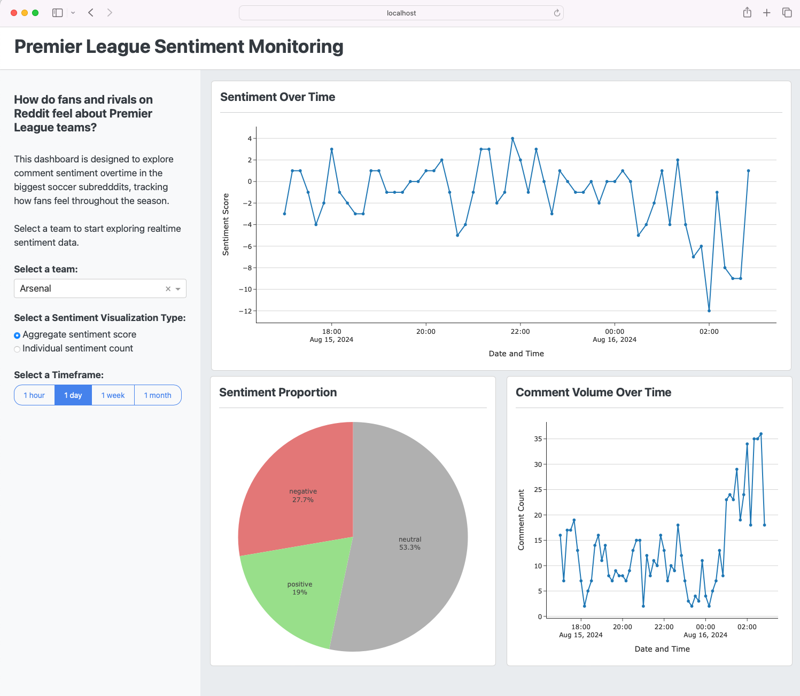
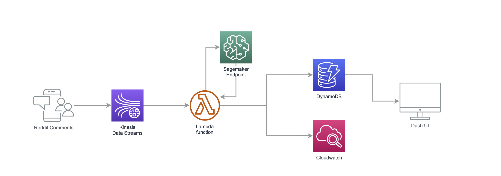

# Real-Time Premier League Sentiment Dashboard

Welcome to the real-time premier league sentiment dashboard! This project is an application designed
to monitor and visualize fan sentiment across Premier League teams in real-time using Reddit
comments. The dashboard is powered by a scalable AWS backend and a dynamic front-end built with Dash. 

<!-- TABLE OF CONTENTS -->

  
Table of Contents

  <ol>
    <li>
      <a href="#about-the-project">About The Project</a>
      <ul>
        <li><a href="#methodology">Methodology</a></li>
        <li><a href="#architecture">Architecture</a></li>
      </ul>
    </li>
    <li>
      <a href="#getting-started">Getting Started</a>
      <ul>
        <li><a href="#prerequisites">Prerequisites</a></li>
        <li><a href="#installation">Installation</a></li>
      </ul>
    </li>
    <li><a href="#usage">Usage</a></li>
    <li><a href="#roadmap">Roadmap</a></li>
    <li><a href="#contributing">Contributing</a></li>
    <li><a href="#license">License</a></li>
    <li><a href="#contact">Contact</a></li>
    <li><a href="#acknowledgments">Acknowledgments</a></li>
  </ol>

<!-- ABOUT THE PROJECT -->
## About the Project
Football (or soccer) has an immense global community where fans express their passion, joy,
frustration, and opinions through various platforms, with Reddit being one of the most prominent.
This project was inspired by the desire to track how fans feel about their favorite teams as the 
season progresses. By analyzing the sentiment in Reddit comments, this project provides insights
into how public opinion shifts over time, influenced by match results, player performance, and team
standings.

A sample of what the dashboard looks like running is shown below:

 

    

### Architecture:

#### Data Ingestion:
<ul>
    <li><strong>Reddit Comment Collection:</strong> Using the PRAW API, the application continuously 
    streams comments from r/soccer and the largest subreddit for each individual Premier League 
    team.</li>
    <li><strong>Data Streaming:</strong>AWS Kinesis is used to stream data in real-time. As comments
    are generated by PRAW, they are serialized and placed in a Kinesis stream.</li>
    <li><strong>Data Processing:</strong>AWS Lambda functions are employed to process records as
    they come in through the Kinesis stream. The Lamda function invokes a SageMaker enpoint for
    real-time inference, and stores the results in DynamoDB.</li>
</ul>

#### Sentiment Analysis
<ul>
    <li><strong>Model:</strong>Comment sentiment is determined through a pre-trained Hugging
    Face 'RoBERTa' model fine-tuned on Twitter data. This model is well-suited for short text and
    social media content, making it ideal for this use case.</li>
    <li><strong>Real-time Inference:</strong>A SageMaker endpoint is used to perform real-time
    sentiment analysis of incoming comments. Each comment is classified as positive, negative, or
    neutral, and this label, along with the sentiment score, is stored in DynamoDB.</li>
</ul>

#### Visualization
<ul>
    <li><strong>Dashboard:</strong>The front-end is built using Dash, leveraging Plotly for dynamic
    visualizations and Dash Boostrap Components for layout and control components. The dashboard
    provides a real-time view of sentiment trents, comment volume, and sentiment distribution for
    different teams.</li>
</ul>

 

The diagram below shows a high-level overview of the cloud architecture for this project.

 

    

## Setup Instructions: